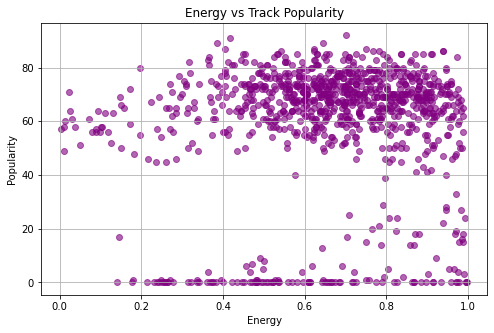
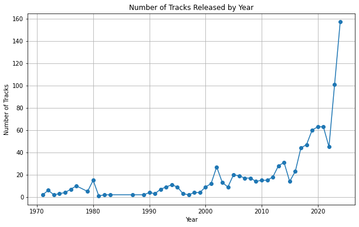
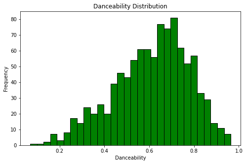

# PROJECT TITLE: ANALYZING USER BEHAVIOUR & MUSIC TRENDS ON SPOTIFY

# PROJECT OVERVIEW
This project centers on analyzing a Spotify dataset to explore user listening patterns, music trends, and the characteristics that contribute to a song's popularity. The dataset contains detailed information on individual tracks, including features such as danceability, energy, tempo, loudness, acousticness, and popularity scores, along with metadata like artist name, release date, and genre.

# BUSINESS UNDERSTANDING
This project aims to leverage Spotify's user and music data to gain valuable insights into user behavior, music trends, and preferences. By analyzing patterns in listening habits, user demographics, and track popularity, the goal is to help Spotify or any related business understand how users interact with the platform. 

# DATA UNDERSTANDING
The dataset provides rich information that can help us understand musical trends, track characteristics, and user engagement. By analyzing audio features alongside popularity metrics, we can uncover patterns that might help with improving music recommendation systems, playlist curation, and targeted marketing efforts. It will also allow for more in-depth exploration of how various factors such as genre, tempo, or mood influence a track's success on the platform.

# ANALYSIS
1. Top 15 genres by count

From the figure above: Pop is the most common genre in the dataset, with about 250 tracks labeled as pop, indicating a mainstream music focus.

2. Energy vs Popularity

The Energy vs Popularity implies that energy doesn't directly affect popularity and other features might matter more (like genre, danceability).

3. Distribution of danceability

From the figure above: Most tracks in the dataset were released in 2020, followed by 2019 and 2018.This suggests the dataset is heavily weighted toward recent years, especially 2017–2021.

4. Histogram: Distribution of danceability

 The above Histogram suggests that most songs have moderate danceability, rather than extreme high or low values.

# TABLEAU

# CONCLUSION
1. High energy and danceability scores are typically associated with tracks that have higher popularity. Tracks that are upbeat and easy to dance to tend to be more engaging for listeners.
2. Acousticness tends to be higher in genres like folk and indie music, which often feature more subtle, less commercialized soundscapes.
3. Older tracks may lose their initial popularity but may still have a loyal following, especially if they remain relevant due to nostalgia or ongoing cultural significance.
4. A balance of energy, danceability, and positivity tends to result in higher popularity across different genres and listener groups.

# RECOMMENDATION
1. Consider incorporating mood-based playlists, utilizing the valence and acousticness features to help users discover songs that fit specific moods.
2. Introduce genre-specific playlists that leverage common audio feature patterns (e.g., create specific playlists for high instrumentalness or acoustic genres like folk, jazz).
3. Offer promotional support to rising artists in these genres to help increase their visibility on the platform, targeting users who engage with similar music styles.
4. Encourage user participation in playlist creation and sharing to increase user-generated content, leveraging the social aspect of Spotify.
5. Analyze shifts in audio features over time, helping Spotify predict which features or genres will resonate with audiences in the near future (e.g., rise in demand for lo-fi beats, or orchestral pop).